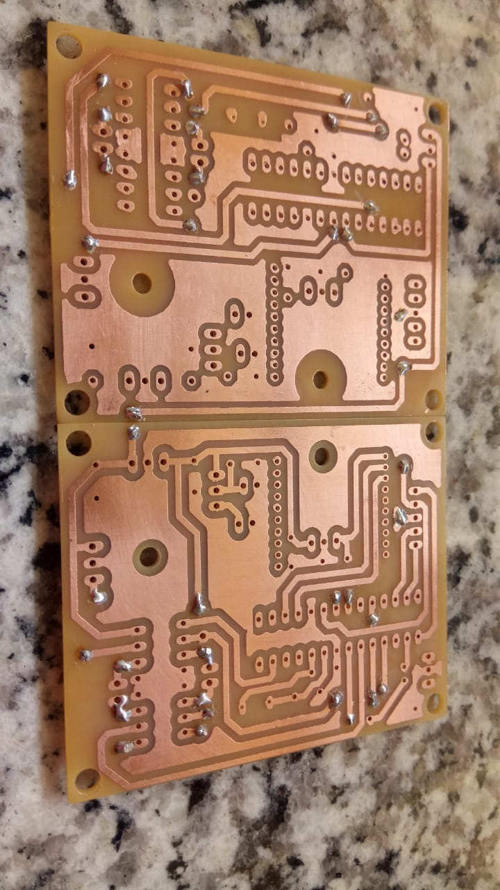
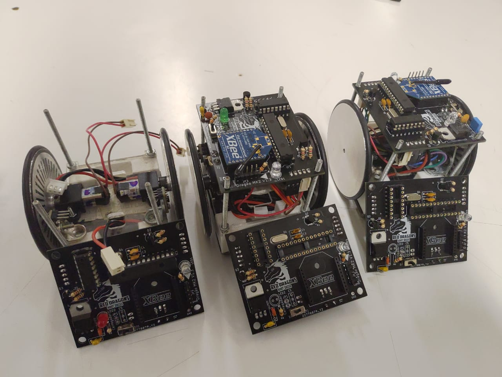
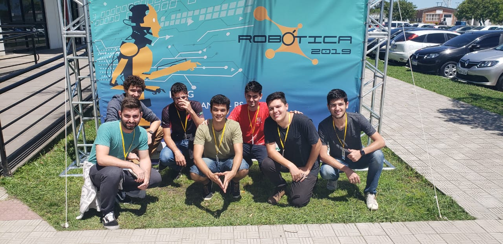

# About me
I'm a Electical engineering major at Federal University of São Carlos.
Ever since I was a child, I've been fascinated by science and technology, specially electronics and computers. I actually started with electronics way before university, building simple circuits ever since I was around 8, through my father, influence (and parts!).
At around 11, I had my first introduction to robotics and microcontrollers, when I got a Parallax Boe-Bot kit for christmas. It was a simple robot, with two continuous servos for powertrain and a PIC16 running a BASIC interpreter. Seems rudimentary, but back then the embedded field wasn't as beginner and hobby friendly as it is today.
Later, I started playing with more advanced circuitry, implementing contact and ultrasound sensors in my robot and sound synthesizers so it could play some tunes and, of course, blinking LEDs.
Later, as a teenager, I discovered Arduino, and began to dabble with C programming language. At the same time, I took an interest in higher level languages, like Lua, to implement games and other programming projects.

# Education
Bachelor of science in electrical engineering.
Federal University of São Carlos, Brazil.
2017-2021

# Work Experience

## Pi Tecnologia
Electronics intern, [Pi Tecnologia](https://www.linkedin.com/company/pi-tecnologia/).
May 2020, Sep 2020.
Developed activities such as, but not limited to:
- Design of a Printed Circuit Boards in Altium Designer for production.
- Hardware support for software and applications team testing.
- High speed comunication debugging, including SPI, I2C and LVDS.
- Systematic testing for product activation, including firmware and FPGA bitstream loading.
- Embedded Linux developtment.
- Jira tracking and agile development.

# Projects

## Electronics Lead, Red Dragons Robot Soccer
[Red Dragons Robot Soccer](https://www.linkedin.com/company/red-dragons-ufscar/) is a student organization competing in the IEEE Very Small Size Soccer I have been involved since 2018, and have been the electronics lead since 2020, being responsable for the development of the robot's electronics systems, including hardware design and firmware.
For the VSSS category,  each team has either 3 or 5 autonomous 10x10cm robots with different roles, with the objective of pushing the ball to the opposite goal. Altough it seems simple, computer vision systems and control algorithms must be implemented so that the robots know where they are in relation to the field, where the ball is and what actions must be taken to sucessfully socre a goal, without violating the rules.

### 2018
I joined the team in 2018, at which point homemade, heat transfer PCBs were still being used. That was only possible because of the low complexity of the electronics systems, that included a PIC18 microncotroller, a XBEE serial radio, motor driver and voltage regulators. To improve the boards' complexity, stacked homemade PCBs proved unreliable, so we had to think about either upgrading our manufactoring techniques, or remaining with low complexity hardware.

{:height="50%" width="50%"}

### 2019
Early in 2019, we participated in the IRONCUP robotics competition, VSSS category, in Santa Rita do Sapucaí, MG, Brazil, a regional event.
Going forward, it was decided the board had to have a higher level o manufacturing quality. The next step was to upgrade the design and contact an overseas manufacturer. The resulting PCB proved to be more reliable, easier to assemble and more appealing to the eye.

{:height="70%" width="70%"}

Later that year, I had the privilege to participate in the 2019 Latin American Robot Competition - LARC, VSSS category, in Rio Grande, RS, Brazil. Altough we had some problems with motor reliability, it was a fantastic experience.

{:height="70%" width="70%"}

### 2020
After being the team's electronics representative during LARC 2019, I decided it was time I took a higher role in the project, so I started 2020 as the project's electronics lead, with the intent to revamp it. It was decided that the next step forward was to restart it, choosing a modern microcontroller and SMD components. At the time, I was also working as an intern at Pi Tecnologia, where I'd routinely work with small footprint SMD componentes, so it was only natural I tried to introduce some of that tecnology to the team.
Despite the global pandemic, we were able to assemble a prototype board, which later was implemented in a prototype robot.

{:height="50%" width="50%"}

## Dinamo E-Racing
[Dinamo E-Racing](https://www.linkedin.com/company/formulaerouteufscar/) is a student organization focused on participating in the FSAE Electrical Vehicle competition.

### 2020
Being interested in automotive tecnology and formula racing, I joined the team in the second half of 2019. As of 2020, I was a member of the Electrical team, responsible for all the protection circuits for FSAE rule compliance and telemetry systems. The main focus of development was a fail-safe approach to systems engineering, with the driver's safety in mind and integration with the mechanical systems.
Although our first car is yet to be constructed, our goal during the pandemic was to finish the project so that as soon as we'd be able to return to our shop, at the UFSCar campus, the fabrication would begin.

# Research
As a student researcher unde the PIBIC program, I studied the applicability of Silicon Carbide MOSFETs in power electronics. More so, the efficiency gains using this novel material as the switch in switching regulators, and all the design considerations necessary to deal with the increased speeds. The research report can be read in full at <a href="username.github.io/documents/RelatorioICT_Pietro" target="_blank">PDF.</a>.
As for PIBIC rules, the report is in portuguese, but if interested please contact me, I'd be happy to translate it.
There's also a short (~6 minutes) video presentation about the research for a university student research congress: [Link](https://www.youtube.com/watch?v=gVqps94csn8).