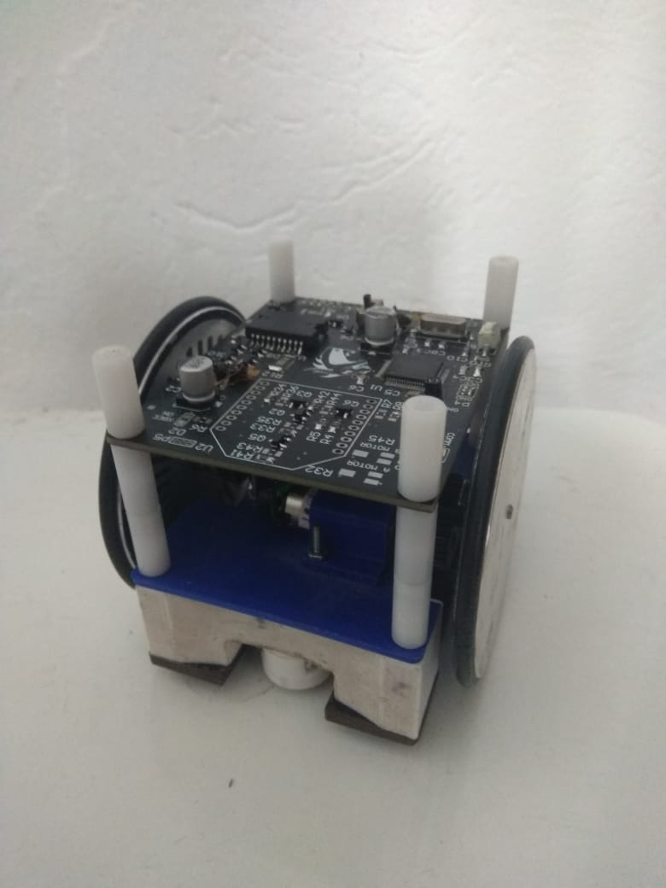

# Welcome to my page
Electical engineering major, Federal University of São Carlos.

# Education
Bachelor of science in electrical engineering.
Federal University of São Carlos, Brazil.
2017-2021

# Work Experience
Electronics intern, [https://www.linkedin.com/company/pi-tecnologia/](Pi Tecnologia).
May 2020, Sep 2020.
Developed activities such as, but not limited to:
- Design of a Printed Circuit Boards in Altium Designer for production.
- Hardware support for software and applications team testing.
- High speed comunication debugging, including SPI, I2C and LVDS.
- Systematic testing for product activation, including firmware and FPGA bitstream loading.
- Embedded Linux developtment.

# Projects
## Electronics Lead, Red Dragons Robot Soccer
[Red Dragons Robot Soccer](https://www.linkedin.com/company/red-dragons-ufscar/) is a student organization competing in the IEEE Very Small Size Soccer I have been involved since 2018, and have been the electronics lead since 2020, being responsable for the development of the robot's electronics systems, including hardware design and firmware.
For the VSSS category,  each team has either 3 or 5 autonomous 10x10cm robots with different roles, with the objective of pushing the ball to the opposite goal. Altough it seems simple, computer vision systems and control algorithms must be implemented so that the robots know where they are in relation to the field, where the ball is and what actions must be taken to sucessfully socre a goal, without violating the rules.

### 2018
I joined the team in 2018, at which point homemade, heat transfer PCBs were still being used. That was only possible because of the low complexity of the electronics systems, that included a PIC18 microncotroller, a XBEE serial radio, motor driver and voltage regulators. To improve the boards' complexity, stacked homemade PCBs proved unreliable, so we had to think about either upgrading our manufactoring techniques, or remaining with low complexity hardware.
{:height="50%" width="50%"}

## 2019
Early in 2019, we participated in the IRONCUP robotics competition, VSSS category, in Santa Rita do Sapucaí, MG, Brazil, a regional event.
Going forward, it was decided the board had to have a higher level o manufacturing quality. The next step was to upgrade the design and contact an overseas manufacturer. The resulting PCB proved to be more reliable, easier to assemble and more appealing to the eye.
{:height="50%" width="50%"}
Later that year, I had the privilege to participate in the 2019 Latin American Robot Competition - LARC, VSSS category, in Rio Grande, RS, Brazil. Altough we had some problems with motor reliability, it was a fantastic experience.

## 2020
After being the team's electronics representative during LARC 2019, I decided it was time I took a higher role in the project, so I started 2020 as the project's electronics lead, with the intent to revamp it. It was decided that the next step forward was to restart it, choosing a modern microcontroller and SMD components. At the time, I was also working as an intern at Pi Tecnologia, where I'd routinely work with small footprint SMD componentes, so it was only natural I tried to introduce some of that tecnology to the team.
Despite the global pandemic, we were able to assemble a prototype board, which later was implemented in a prototype robot.
{:height="50%" width="50%"}